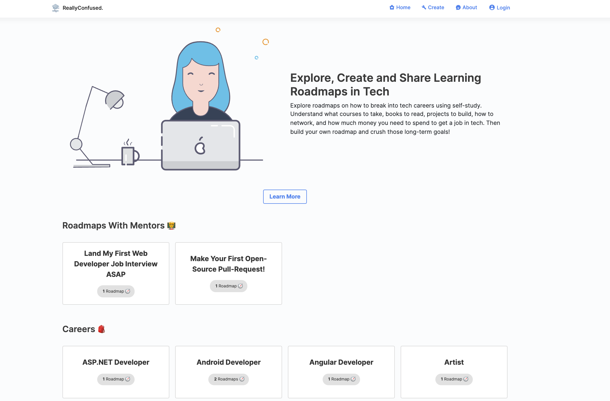
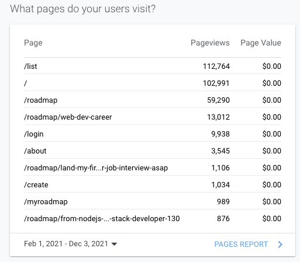

ReallyConfused: Explore, Create and Share Learning Roadmaps in Tech

------------------------------------------------------------------------------------------

Explore roadmaps on how to break into tech careers using self-study. Understand what courses to take, books to read, projects to build, how to network, and how much money you need to spend to get a job in tech. Then build your own roadmap and crush those long-term goals! 

Link to [ReallyConfused.co](https://reallyconfused.co/)

------------------------------------------------------------------------------------------

## Features

- **Explore Roadmaps Made By Self-Learners**: How do you become a Full-Stack Developer after learning JavaScript? How does one start with Python and become a Data Scientist? Find out here! Get access to the unique journeys of self-learners who leveraged the internet to get a job of their choice and explore roadmaps curated from the internet.

- **Build Your Own Roadmap And Pursue Long-Term Goals**: Found an interesting roadmap to becoming a Node.js Developer? Take it up, edit the timeline, add your own steps, and work towards it! Organize the schedule, and we'll remind you to learn that language or watch that Coursera course or read that book every day! Additionally, share your awesome roadmap with the whole world and grow together!

- **Explore Careers Day-To-Days and Project Ideas**: What kind of business problems does a Data Analyst or a Data Engineer solve? How can you align what you're learning now with the tech job of your choice? Additionally, explore project ideas that you can build to maximize your chances of landing a job in that field!

## Goal

Ultimate aim of ReallyConfused is to have all the subjective nuances of every career as a roadmap in place so that beginners will know there is no one true prescription to get any creative job and you need to make your own path or roadmap.

## Installation instructions

Caution: Frontend is promised to have a host of bugs. Like, for sure. The people who developed this had never professionally worked with frontend before. If you plan on contributing and feel like breaking the keyboard do think of the generalist engineer who tried to patch a partial frontend up to get the vision out there. So you might ask is the backend better? Not absolutely, but comparatively, yeah. Thank you.

* [golang backend installation instructions](https://github.com/guyandtheworld/reallyconfused/blob/master/go-apis/README.md)
* [nextjs frontend installation instructions](https://github.com/guyandtheworld/reallyconfused/blob/master/next-ui/README.md)

## Miscellaneous Information

### Opportunities

* [4418 upvotes, 200 comments, 177 awards, the top post of the month on r/learnprogramming](https://www.reddit.com/r/learnprogramming/comments/lrcrxx/to_make_careerplanning_less_confusing_while/)
* Use SEO to utilize keyword searches like "python roadmap", "crypto roadmap" that are on the rise to onboard users. It's built with NextJS which is extremely SEO friendly.
* Build custom roadmaps for users with the help of mentors and follow their journey.
* Get influencers to post their roadmaps since a lot of dev influencers get asked the same question by beginners.
* Get course creators to post their roadmaps to increase engagement on their course.
* Increase the number of roadmaps which was the most requested item by the users (refer to the first Reddit post).
* Onboard cohort-based courses and mentors to post their syllabus to generate leads and for tracking student progress through the "fork" feature.
* The product was short-listed by YC, but we couldn't crack the interview.

### Tech Stack
* Frontend - NextJS
* Backend - Golang
* Database - Postgres
* Cloud Provider - DigitalOcean
